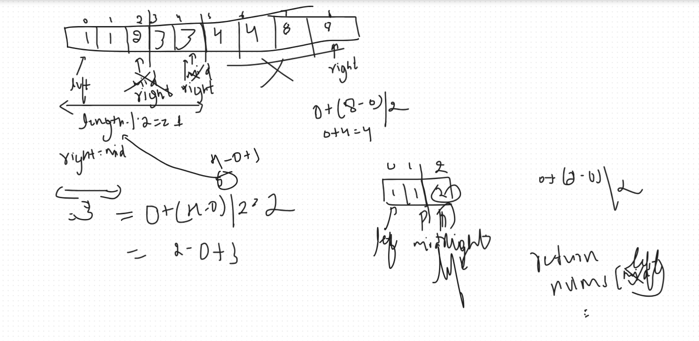

<h1 align="center">Single non Duplicate in a sorted Array</h1>

## Description
You are given a sorted array consisting of only integers where every element appears exactly twice, except for one element which appears exactly once.

Return the single element that appears only once.

Your solution must run in O(log n) time and O(1) space.

 

Example 1:

Input: nums = [1,1,2,3,3,4,4,8,8]
Output: 2

## My Approach :
* Use a hashmap to keep the number of occurences and check for the key with value 1 and just return it simple

```java
class Solution {
    public int singleNonDuplicate(int[] nums) {
        Map<Integer, Integer> map = new HashMap<>();
        for(int n : nums) {
            if(map.containsKey(n)) {
                map.put(n, map.get(n) + 1);
            } else {
                map.put(n , 1);
            }
        }

        for(int key : map.keySet()) {
            if(map.get(key) == 1) {
                return key;
            }
        }
        return -1;
    }
}
```

## Better approach :
* Using a Binary search approach Use this for similar problems


* Here we divide the array by finding the mid using the formula ***mid = left + (right - left)/2*** after calculating mid 
* we do ***if(nums[mid] == numd[mid + 1])*** to make sure that we divide the array along with the mid's pair
* Calculate the length of the left side of the array using length = mid - left + 1 
* If the length is even then move the left to mid+1 because the solution exists at right partition
* Otherwise, shift the right to mid and do this until left < right and return nums[left]

```java
class Solution {
    public int singleNonDuplicate(int[] nums) {
        int left = 0;
        int right = nums.length -1;
        while(left < right) {
            int mid = left + (right - left)/2;
            if(nums[mid] == nums[mid + 1]) {
                mid = mid - 1;
            }
            int leftLength = (mid - left) + 1;
            if(leftLength % 2 == 1) {
                right = mid;
                
            } else {
                left = mid + 1;
            }
        }
        return nums[left];
    }
}
```


